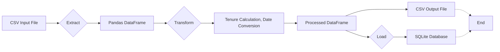

# ETL Pipeline Documentation

This document describes an ETL (Extract, Transform, Load) pipeline implemented in Python for processing employee data.  The pipeline reads data from a CSV file, performs transformations, and loads the processed data into both a CSV file and an SQLite database.

## 1. Overview

The ETL pipeline processes employee data from a CSV file located at `input_path`.  It calculates employee tenure based on their joining date and saves the processed data to a CSV file in the `output_dir` and an SQLite database at `db_path`.

## 2.  Pipeline Steps

### 2.1 Extract

The pipeline begins by extracting data from a CSV file specified by the `input_path` argument. The `pandas` library is used to read the CSV into a Pandas DataFrame.

```python
df = pd.read_csv(input_path)
```

### 2.2 Transform

The following transformations are applied to the DataFrame:

1. **Date Conversion:** The 'joining_date' column is converted to datetime objects using `pd.to_datetime()`.

2. **Tenure Calculation:** Employee tenure in years is calculated by subtracting the 'joining_date' from the current date and dividing the result (in days) by 365.

```python
df['joining_date'] = pd.to_datetime(df['joining_date'])
df['tenure_years'] = (pd.Timestamp.now() - df['joining_date']).dt.days / 365
```

The processed DataFrame is then saved as a CSV file.

```python
processed_path = os.path.join(output_dir, "employees_processed.csv")
df.to_csv(processed_path, index=False)
```

### 2.3 Load

The transformed data is loaded into two destinations:

1. **CSV File:** A CSV file containing the processed data is created at `processed_path`.

2. **SQLite Database:** The data is loaded into an SQLite database table named "employees" located at `db_path`.  The `if_exists="replace"` argument ensures that the table is replaced if it already exists.

```python
conn = sqlite3.connect(db_path)
df.to_sql("employees", conn, if_exists="replace", index=False)
conn.close()
```

## 3.  Directory Structure

The pipeline automatically creates necessary directories if they don't exist:

*   `output_dir` (default: "data/processed") – Stores the processed CSV file.
*   Directory containing `db_path` (default: "outputs/datasets") – Stores the SQLite database.

## 4. Function Signature

```python
def run_etl(input_path, output_dir="data/processed", db_path="outputs/datasets/company.db"):
    # ... (pipeline code) ...
    return processed_path, db_path
```

The `run_etl` function takes the input CSV file path as a required argument and offers optional arguments for specifying the output directory and database path.  It returns the paths to the processed CSV file and the SQLite database.


## 5. Mermaid Diagram




## 6. Error Handling

The `os.makedirs` function with `exist_ok=True` handles cases where the output directories already exist.  More robust error handling (e.g., handling exceptions during file reading or database operations) could be added for production environments.
